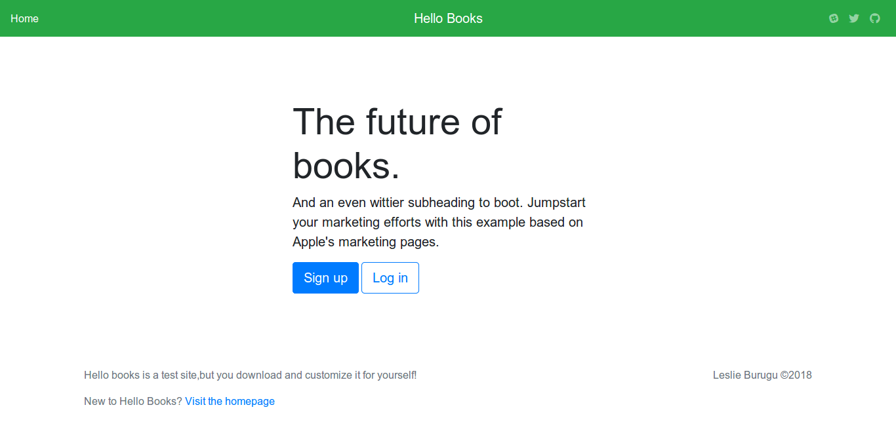

# Hello Books

Hello-Books is a simple application that helps manage a library and its processes like stocking, tracking and renting books. With this application users are able to find and rent books. The application also has an admin section where the admin can do things like add books, delete books, increase the quantity of a book etc.

## Dependencies

-----------------------

* Bootstrap 4.0.0
* Jquery
* Popper.js
* holder.js

## Getting Started

To work with this project on clone this repository via `https` or via `ssh`.

## Opening it up in the browser

Once that is done,open `index.html` in your browser and you will be presented with the landing page that looks like this:
 

## Contribution

If you want to contribute to this project:

* Fork it!
* Create your feature branch: git checkout -b my-new-feature
* Commit your changes: git commit -am 'Add some feature'
* Push to the branch: git push origin my-new-feature
* Submit a pull request
